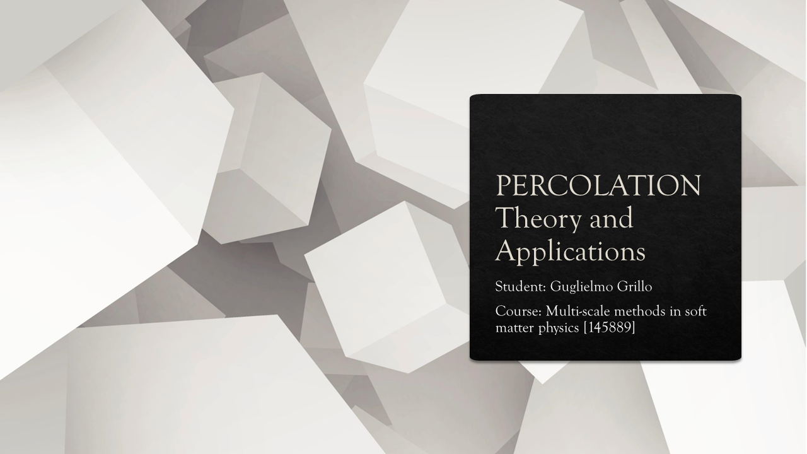
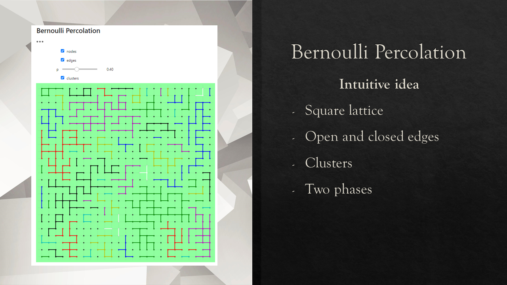
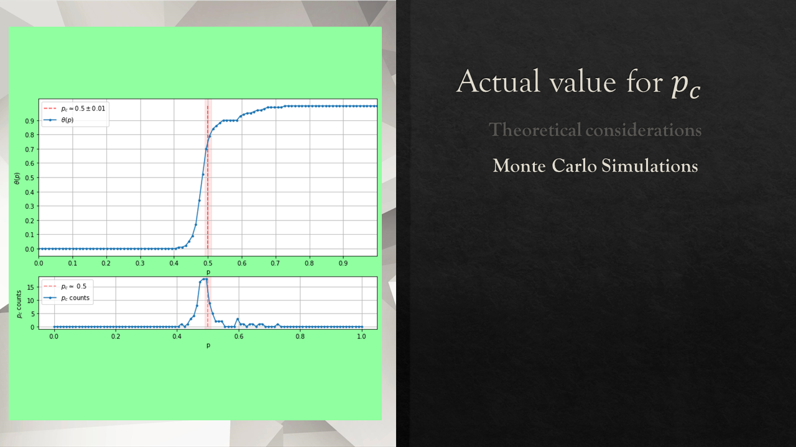
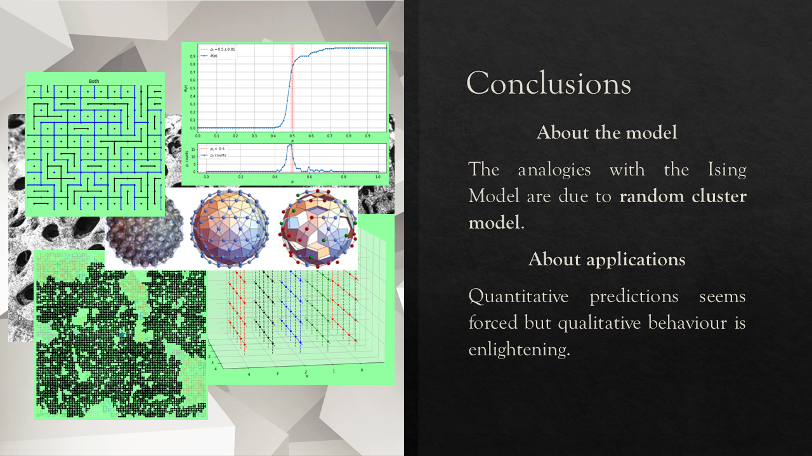
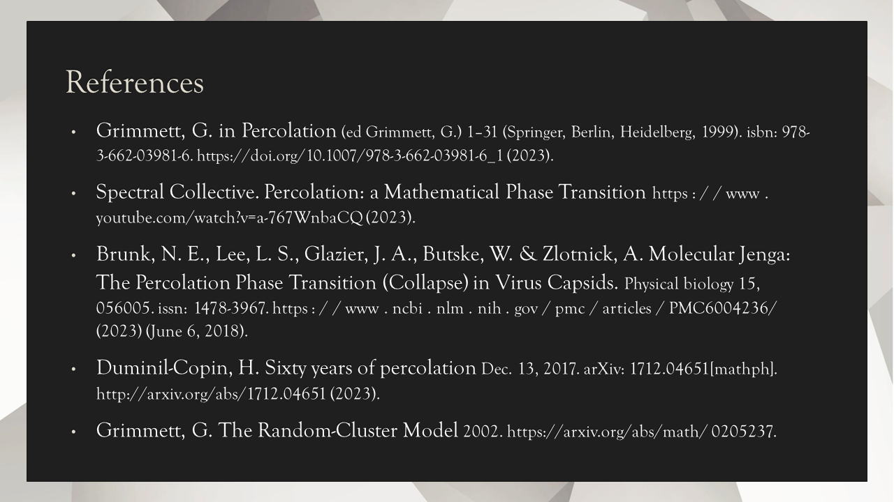

## Percolation - Theory and Applications
---


---
Review and project for the course _Multi-scale methods in soft matter physics [145889]_ held by prof. _R. POTESTIO_ (University of Trento, a.y. 2021/22).


The repository contains the review `GRILLO_Percolation_Multi-Scale.pdf` as a pdf file, a PowerPoint presentation available as a pdf `Slides.pdf`, and a Jupyter Notebook containing the code used to generate most of the figures present in the slides. The code was written in python on [Jupyter lab](https://jupyter.org/). Its purpose is to produce plots and not to compute quantities so optimization was not a priority.

### Review Abstract
> _The Ising model is usually the archetypical model of phase transition for physicists due to its close link with magnetism. On the other hand, mathematicians are typically introduced to the concept of phase transition via a different model called percolation. My aim with this review is to present an introduction to the Bernoulli percolation model and prove that a phase transition does indeed exist in any dimension d ≥ 2. In the final part of the review, I’ll also present attempts to apply Bernoulli percolation to physical problems._


## Project Screen Shots





## Installation and Setup Instructions
The repository contains a [conda](https://docs.conda.io/en/latest/) environment ready to be installed.
```
conda env create -f environment.yml
```
Done that, it's just a matter of starting Jupyter Lab in the correct folder.


## Reflection
This is actually not my original project for the course. Initially, I was supposed to work with the other two students on the problem of protein folding applied to prions (I'll link here their repository after they finish setting it up). After a couple of weeks of working on the project, I found myself struggling to keep up with the pace of the group due to not enjoying the process. Most of the tools we were using where black boxes which I had a hard time grasping its inner working (I later found out that there was a whole course dedicated to these tools which were not in my study plan). As I both wasn't enjoying the process and felt like I wasn't contributing enough, I decided together with the other two students that I'd have dropped the project.  

Fast forward a few months after, I came across the video  [Percolation: a Mathematical Phase Transition](https://www.youtube.com/watch?v=a-767WnbaCQ), and with the professor, we agreed that I'd have done a review on the topic. But after handling the paper I felt like something was missing: a coding part. For this reason, a developed a few scripts and a Montecarlo simulation that turned out perfect to produce the images I put in the slides.

### Lesson Learned with this project
- It's always hard to admit, but if you are neither enjoying nor contributing to a project it's usually better to openly talk about it and find something that better suits you;
- To enjoy a project I need both a coding/programming part and an in-depth understanding of what's happening behind the code/framework used;
- Matplotlib is tunable enough to produce slide-ready images (when used properly)

## References

